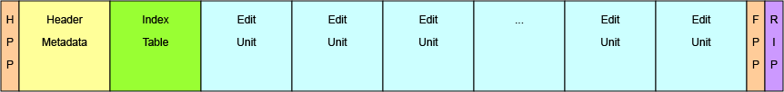

# MXF File Structure and Mapping

## General

SMPTE ST-2117-10 MXF files specified by this document shall have one of the two structures illustrated in Figure 1 and Figure 2 respectively.
**HPP** is an shorthand for Header Partition Pack,
**BPP** is an shorthand for Body Partition Pack and
**FPP** is a shorthand for Footer Partition Pack.

In the source markdown - this shows how to do a figure



In the source markdown - this shows how to do a figure caption. In ISO, caption figures are below pictures and table captions are above figures.
The syntax starting with `:::` is known as a fence block and creates a section with a paragraph style in word.

::: {custom-style="smpte-caption"}
Figure 1 - Single Essence Location Style
:::

## Heading 2

As shown in Figure 1, this style consists of a Header Partition, a Footer Partition, and a Random Index Pack.

A bulletted list.

* It is easy to handle because of a simple structure
* It is easy to edit while file transferring
* It is easy to select an extract, or a “Partial file”

A numbered list.

1. Index Table Segment::Single Index Location TRUE (Single Location)
2. Index Table Segment::Single Location TRUE (Single Location)
3. Index Table Segment::Forward Index Direction TRUE (Forward)
4. Preface:: is RIP present TRUE

## Code example

Figure 2 below shows some raw JSON for the term `Interoperability`

```json
{
    "@id": "https://vocabulary.pbs.org/OSAGlossary/63",
    "@type": ["http://www.w3.org/2004/02/skos/core#Concept"],
    "http://purl.org/dc/terms/contributor": [{
        "@id": "https://vocabulary.pbs.org/user/hubbards"
    }],
    "http://purl.org/dc/terms/created": [{
        "@type": "http://www.w3.org/2001/XMLSchema#dateTime",
        "@value": "2021-05-20T17:36:31.650Z"
    }],
    "http://purl.org/dc/terms/creator": [{
        "@id": "https://vocabulary.pbs.org/user/hubbards"
    }],
    "http://purl.org/dc/terms/modified": [{
        "@type": "http://www.w3.org/2001/XMLSchema#dateTime",
        "@value": "2021-05-21T01:00:15.850Z"
    }],
    "http://www.w3.org/2004/02/skos/core#definition": [{
        "@language": "en",
        "@value": "NIST: The ability of two or more systems or applications to exchange information and to mutually use the information that has been exchanged."
    }],
    "http://www.w3.org/2004/02/skos/core#prefLabel": [{
        "@language": "en",
        "@value": "Interoperability"
    }],
    "http://www.w3.org/2004/02/skos/core#scopeNote": [{
        "@language": "en",
        "@value": "NIST SP 500-XXX: The NIST Cloud Federation Reference Architecture (Draft)"
    }, {
        "@language": "en",
        "@value": "OSA Vocabulary Group (Proposed)"
    }],
    "http://www.w3.org/2004/02/skos/core#topConceptOf": [{
        "@id": "https://vocabulary.pbs.org/OSAGlossary/0"
    }]
}
```

::: {custom-style="smpte-caption"}
Figure 2 - JSON in the raw
:::

::: {custom-style="smpte-caption"}
Table 1 - Output from raw JSON
:::

| Term             | Definition (too complex with Pandoc}  |
|------------------|-------------------------------------- |
| Interoperability | No substitution possible              |

Figure 3 below shows an alternative _smunched_ version of the `.jsonld` file to make the documents easier to generate.
Basically it rearranges the JSON so that it's easy for a human to reference a term rather than manage an abstract
list of terms with generic relationships.

```json
{
  "Interoperability": {
    "@id": "63",
    "contributor": "hubbards",
    "definition": "NIST: The ability of two or more systems or applications to exchange information and to mutually use the information that has been exchanged.",
    "label": "Interoperability",
    "note": "NIST SP 500-XXX: The NIST Cloud Federation Reference Architecture (Draft)",
    "status": "Proposed"
  }
}
```

::: {custom-style="smpte-caption"}
Figure 3 - smunched JSON
:::

::: {custom-style="smpte-caption"}
Table 2 - Output from smunched JSON
:::

| #                        | Term             | Definition                            | Note
|--------------------------|------------------|-------------------------------------- | ----
| {{Interoperability.@id}} | Interoperability | {{Interoperability.definition}}       | {{Interoperability.note}}
